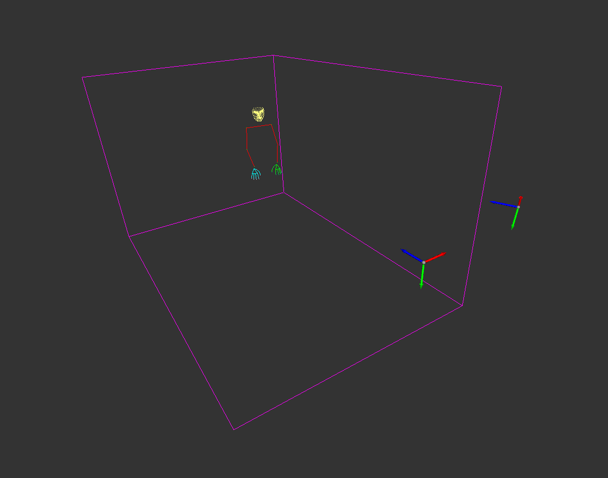

# Stereo Motion Capture

## Overview
This repository contains the implementation of a stereo motion capture system designed to accurately track and record 3D human motion in real-time. The project leverages Google's MediaPipe for robust feature detection and tracking, and implements the Direct Linear Transform (DLT) algorithm for the triangulation of 2D camera pixels into 3D space coordinates.



[Youtube](https://youtu.be/LWCxKxISCeY)

## Features
- **Real-time 3D Motion Capture**: Utilizes synchronized stereo cameras to capture dynamic motion in real-time.
- **MediaPipe Integration**: Implements MediaPipe for high-fidelity feature detection, taking advantage of its pre-trained machine learning models.
- **DLT-Based Triangulation**: Employs the DLT algorithm for accurate conversion of 2D image points from stereo cameras into 3D world coordinates.
- **3D Visualization**: Includes a simple 3D visualization tool to view captured motion data in three dimensions.

## Installation
To set up the stereo motion capture system, follow these steps:

1. Clone the repository:
```bash
git clone https://github.com/Alex-Winner/Mocap3D.git
cd Mocap3D
```

2. Install the required dependencies:
```bash
pip install -r requirements.txt
```

3. Set up your stereo camera system according to the instructions in the [camera_setup.md](/docs/camera_setup.md) file.

## Usage

1. Calibration
Before using the system, ensure that the stereo cameras are properly calibrated. <br>
Follow the detailed calibration instructions provided in [calibration_instructions.md](/docs/calibration_instructions.md).

2. Run mocap software:
Run the script with live cameras using camera IDs
Use '0' for the first camera and '1' for the second camera (Opencv Id)
`Mocap3d.py` will record a video into the `\media` directory.

```bash
python Mocap3d.py 0 1
```
or play recorded video from `media\camera_0.avi` and `media\camera_1.avi` by running:

```bash
python Mocap3d.py
```

3. Run `show_3d_pose.py` script <br>
The script will show the recorded motion in Open3D Renderer.
```bash
python show_3d_pose.py
``` 

## Contributions
Contributions to this project are welcome! Please submit a pull request or create an issue if you have ideas for improvement.

## Acknowledgments
- Google's MediaPipe for their state-of-the-art feature detection algorithms.
- The creators and contributors of the Direct Linear Transform algorithm.